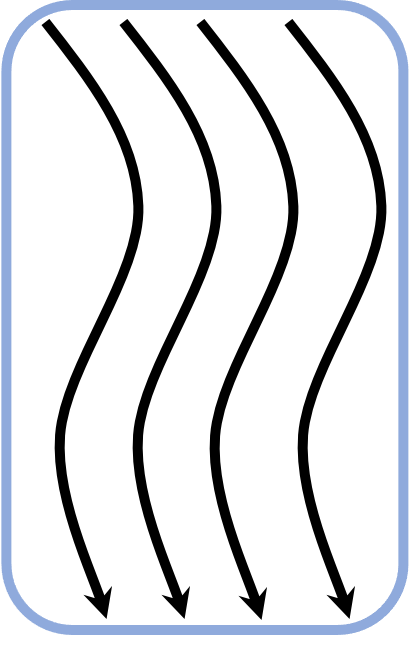
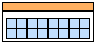
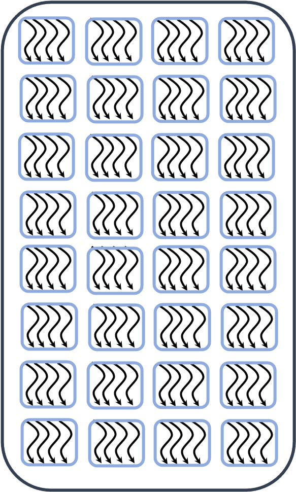
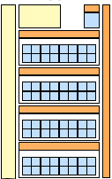

# GPU Execution Model{.section}

#  Heterogeneous Programming Model

- GPUs are co-processors to the CPU
- CPU controls the work flow:
  - *offloads* computations to GPU by launching *kernels*
  - allocates and deallocates the memory on GPUs
  - handles the data transfers between CPU and GPUs
- CPU and GPU can work concurrently
   - kernel launches are normally asynchronous

# Example: axpy

<div class="column">

Serial cpu code of `y=y+a*x`:

- have a loop going over the each index


<small>
```cpp
void axpy_(int n, double a, double *x, double *y)
{
    for(int id=0;id<n; id++) {
        y[id] += a * x[id];
    }
}
```
</small>
</div>

<div class="column">

On an accelerator:

- no loop 
- we create instances of the same function, **kernels**
<small>

```cpp
GPU_K void axpy_(int n, double a, double *x, double *y, int id)
{
        y[id] += a * x[id]; // id<n
}

```
</small>

</div>


# Work-items

<div class="column">


{.center width=5%}

<div align="center"><small>A work-item is running on a simd lane</small></div>

</div>

<div class="column">

{.center width=31%} 

<div align="center"><small>The smallest computational element in a GPU.</small></div>
</div>

- the work-items are very light execution contexts.
- contain all information needed to execute a stream of instructions.
- for each work-item there is an instance of the **kernel**. 
- each work-item processes different elements of the data (SIMD).

# Sub-Group

<div class="column">


{.center width=15%}

<div align="center"><small>Execution is done per sub-groups.</small></div>

</div>

<div class="column">

{.center width=55%} 

<div align="center"><small>Scheme of a SIMD unit in an AMD GPU.</small></div>
</div>
- the work-items are physically locked into sub-groups
- the size is locked by hardware, currently 64 for AMD and 32 for Nvidia.
- an instruction is executed by all items in the sub-group.
- in the case of branching, each branch has to be handled separetely.
- memory accesses are done per sub-group.

# Work-Group

<div class="column">


{.center width=25%}

<div align="center"><small>Work-groups of work-items.</small></div>

</div>

<div class="column">
{.center width=24%}

<div align="center"><small>Compute Unit in an AMD GPU.</small></div>
</div>
- the work-items are divided in groups of fixed size.
- size limited by hardware, 1024 for some GPUS or 8912 for some CPUs.
- each work-group is assign to a Compute Unite (2) and it can not be split. 
- synchronization and data exchange is possible inside a group.


# Grid of Work-Items

<div class="column">


{.center width=35%}

<div align="center"><small>A grid of work-groups executing the same **kernel**</small></div>

</div>

<div class="column">
{.center width=55%}

<div align="center"><small>AMD Instinct MI100 architecture (source: AMD)</small></div>
</div>

- a grid of threads is created on a specific device to perform the work. 
- each work-item executes the same kernel
- each work-item typically processes different elements of the data. 
- there is no global synchronization or data exchange.

# Summary
- GPUs are hardware with high degree of parallelism.
- many threads execute the same instruction (SIMD).
- there is a hierarchy of the work-items (*work-groups*, *sub-groups*).
- all items in the sub-group execute the same instruction.
- branching in a *sub-group* should be avoided
- memory accesses are done per *sub-group*.

