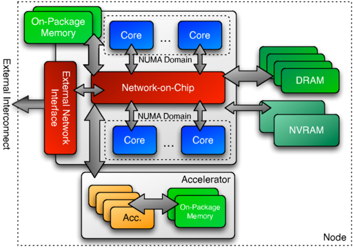

# Kokkos overview

- Kokkos is a C++ performance portability ecosystem
    - Linux Foundation project, originally started in Sandia National Laboratories in 2011
    - Part of the US Department of Energies Exascale Project, developed in several
      supercomputing centers in the US and in Europe
- Abstractions for both parallel execution of code and data management
- Designed to target complex node architectures with N-level memory hierarchies and multiple types of execution resources
- Currently there are CUDA, HIP, SYCL, HPX, OpenMP and C++ threads backends

# Kokkos ecosystem

- The ecosystem includes three main components
- Kokkos Core
    - Parallel Execution and Memory Abstraction
- Kokkos Kernels
    - Sparse, dense, batched math kernels
- Kokkos Tools
    - Profiling and debugging tools

# Kokkos Core

- Kokkos Core is a programming model for parallel algorithms on shared memory many-core architectures
- The model provides abstractions, such as execution spaces, patterns and policies, as well as memory spaces, layouts and traits
- The developer implements the algorithms using these abstractions which allows Kokkos to map and optimize the code for the desired target architectures
- Kokkos Core offers also some architecture-specific features for further optimization, but this breaks the portability of the code

# Kokkos Kernels

- Kokkos Kernels is a software library featuring linear algebra and graph algorithms for optimal performance across various architectures
- The library is written using the Kokkos Core programming model for portability and good performance
- It includes architecture-specific optimizations and vendor-specific versions of mathematical algorithms
- Kokkos Kernels library reduces the need to develop architecture-specific software, lowering the modification cost for achieving good performance

# Kokkos Tools

- Kokkos Tools is a plug-in software interface with a set of performance measurement and debugging tools for analyzing software execution and memory performance
- It relies on the Kokkos Core programming model interface and uses the user provided labels to identify data structures and computations
- A developer can use these tools for performance profiling and debugging to evaluate their algorithmic design and implementation, and to identify areas for improvement

# Kokkos machine model

<div class="column">
- Multiple execution units in a compute node
- Execution units are capable of parallel processing
- Execution units may have distinct memories
</div>

<div class="column">
{.center width=70%}
</div>

# Execution and Memory Spaces

- Kokkos uses an execution space model to abstract the details of parallel hardware 
- The execution space instances map to the available backend options such as CUDA, HIP, OpenMP, or SYCL
- Similarly, Kokkos uses a memory space model for different types of memory, such as host memory or device memory
- If the execution space or memory space are not explicitly chosen by the programmer in the source code, the default spaces are used (chosen during compile time)

# Program execution

- Three kinds of code in a Kokkos program
    1. Code executing inside of a Kokkos parallel operation
    2. Code outside of a Kokkos parallel operation that asks Kokkos to do something (e.g., parallel dispatch itself)
    3. Code that has nothing to do with Kokkos
- One can mix Kokkos with other types of parallelism
    - MPI for parallelization between nodes
    - Other kind of threads e.g. for I/O


# Kokkos Compilation

- Usage of cross-platform portability libraries could require module/package maintainers to compile and offer multiple instances if different projects on the same system require different compilation settings (when used as an installed package)
- For instance, with Kokkos, one project might prefer CUDA as the default execution space, while another requires a CPU
- In addition to package install, Kokkos supports inline building of the Kokkos library with the user project, by specifying Kokkos compilation settings and including the Kokkos Makefile in the user Makefile
<small>
- Kokkos docs: [https://kokkos.github.io/kokkos-core-wiki/building.html](https://kokkos.github.io/kokkos-core-wiki/building.html)
</small>

# Inline build: Hello Makefile example
<small>
```
default: build

# Set compiler
KOKKOS_PATH = $(shell pwd)/kokkos
CXX = hipcc

# Variables for the Makefile.kokkos
KOKKOS_DEVICES = "HIP"
KOKKOS_ARCH = "AMD_GFX90A"

# Include Makefile.kokkos
include $(KOKKOS_PATH)/Makefile.kokkos

build: $(KOKKOS_LINK_DEPENDS) $(KOKKOS_CPP_DEPENDS) hello.cpp
 $(CXX) $(KOKKOS_CPPFLAGS) $(KOKKOS_CXXFLAGS) $(KOKKOS_LDFLAGS) hello.cpp $(KOKKOS_LIBS) -o hello
```
- To build a hello.cpp project with the above Makefile, no steps other than cloning the Kokkos project into the current directory is required

</small>

<small>

- Kokkos docs: [https://kokkos.org/kokkos-core-wiki/ProgrammingGuide/Compiling.html#using-kokkos-gnu-makefile-system](https://kokkos.org/kokkos-core-wiki/ProgrammingGuide/Compiling.html#using-kokkos-gnu-makefile-system)

</small>

# Programming Kokkos

- Kokkos (like SYCL) utilizes heavily modern C++ features like lambdas/functors and templates
- Kokkos code starts with Kokkos initialization and ends with finalization
<small>
```
Kokkos::initialize(int& argc, char* argv[]);
{
...
}
Kokkos::finalize();
```
</small>

- Optional initialization parameters can be passed as follows:

<small>
```
Kokkos::initialize(Kokkos::InitializationSettings()
                   .set_device_id(0)                /* select the device (eg, 0th gpu of the total of 4 gpus) */
                   .set_disable_warnings(false)     /* disable warning messages */
                   .set_num_threads(1)              /* set the number of threads */
                   .set_print_configuration(true)); /* print the configuration after initialization */
```
- Kokkos docs: [https://kokkos.github.io/kokkos-core-wiki/API/core/Initialize-and-Finalize.html](https://kokkos.github.io/kokkos-core-wiki/API/core/Initialize-and-Finalize.html)
</small>


# Kokkos programming - hello example
- The following is a full example of a Kokkos program that initializes Kokkos and prints the execution space and memory space instances
```
#include <Kokkos_Core.hpp>
#include <iostream>

int main(int argc, char* argv[]) {
  Kokkos::initialize(argc, argv);
  std::cout << "Execution Space: " <<
    Kokkos::DefaultExecutionSpace.name() << std::endl;
  std::cout << "Memory Space: " <<
    Kokkos::DefaultExecutionSpace::memory_space.name() << std::endl;
  Kokkos::finalize();
  return 0;
}
```

<small>

* The Kokkos API is accessed through `Kokkos_Core.hpp` header file

</small>

# Memory management in Kokkos {.section}

# Views

- The recommended way to memory management with Kokkos is via `View`.
- `View` is a  multidimensional array which supports indexing and subviews
- The data can reside either in host or in a device
- Memory is automatically deallocated when View goes out of scope (via destructor)
- No `View`s should be existing at the time of `Kokkos::finalize`

# Views

- Number of dimensions is fixed at compile time
- Extent of a dimension can be specified at compile time or at runtime
- Compile time extents need to be rightmost
- Number of dimensions and extents can be queried with the `rank()` and `extent()` methods
- View can be resized
- By default, `View` is allocated on default memory space of the default execution space
    - Different memory space can be specified when constructing `View`

# Views - examples

```cpp
    Kokkos::View<int*> a("a", n); // 1D array with runtime dimension
    Kokkos::View<double*[3]> b("b", n); // 2D n x 3 array with compile time dimension
    Kokkos::View<double**, Kokkos::HostSpace> h_b("h_b", n, m);
    Kokkos::View<double***, Kokkos::SharedSpace> s_b("s_b", n, m, k);
    Kokkos::View<double**, Kokkos::Device<Kokkos::Serial, Kokkos::SharedSpace> >
       s2_b("s2_b", n, m); // Specify execution space

    std::cout << "Execution space of a:    " <<
         decltype(a)::execution_space::name() << std::endl;
    std::cout << "Memory space of a:       " <<
         decltype(a)::memory_space::name() << std::endl;
```
```
$ srun ... ./views
Execution space of a:    HIP
Memory space of a:       HIP
```

# Accessing entries

- The elements of a view are accessed using parentheses enclosing a comma-delimited list of integer indices
  (similar to Fortran and C++23 `mdspan`)
- View’s entries can be accessed only in an execution space which is allowed to access that View’s memory space

```cpp
Kokkos::View<int**, Kokkos::HostSpace> h_a ("h_a", 100, 100);
Kokkos::View<int**, Kokkos::CudaSpace> d_a ("d_a", 100, 100);

h_a(1, 1) = 12;  // OK
d_a(1, 1) = 12;  // Error, can be accessed only from code running on device
```

# Copies between Views

- Kokkos does not copy data from one view to another implicitly
    - Assignment is possible in certain cases, but creates only reference
- Copying of data needs to be done with the `deep_copy` function
```
Kokkos::View<int*> a ("a", 10);
Kokkos::View<int*, Kokkos::HostSpace> b ("b", 10);
Kokkos::deep_copy (a, b); // copy contents of b into a
```

# Memory management with raw pointers

- Kokkos supports also using raw pointers
- With raw pointers, one can simply allocate and deallocate memory by

<small>

```
int* ptr = (int*) Kokkos::kokkos_malloc<Kokkos::SharedSpace>(n * sizeof(int));
...
Kokkos::kokkos_free<Kokkos::SharedSpace>(ptr);
```

</small>

where `Kokkos::SharedSpace` maps to any potentially available memory of "Unified Shared Memory" type, ie,

<small>

* Cuda -> CudaUVMSpace
* HIP -> HIPManagedSpace
* SYCL -> SYCLSharedUSMSpace
* Backends running on host -> HostSpace

</small>
<small>

* Kokkos docs: [https://kokkos.org/kokkos-core-wiki/API/core/c_style_memory_management.html](https://kokkos.org/kokkos-core-wiki/API/core/c_style_memory_management.html)

</small>

# Parallel dispatch {.section}

# Parallel operations

- Kokkos provides three different parallel operations: `parallel_for`, `parallel_reduce`, and `parallel_scan`
  - The `parallel_for` operation is used to execute a loop in parallel
  - The `parallel_reduce` operation is used to execute a loop in parallel and reduce the results to a single value
  - The `parallel_scan` operation implements a prefix scan

- Loop body is functor (explicit or lambda function)

# Example: Parallel for

- The following executes a simple for loop with `i` ranging from `0` to `n-1`:
```
Kokkos::parallel_for(n, KOKKOS_LAMBDA(const int i) {
  c[i] = a[i] * b[i];
});
```
<small>
- Kokkos docs: [https://kokkos.github.io/kokkos-core-wiki/API/core/ParallelDispatch.html](https://kokkos.github.io/kokkos-core-wiki/API/core/ParallelDispatch.html)
</small>

# Example: Parallel reduction

- The following executes a simple reduction loop with `i` ranging from `0` to `n-1` where `lsum` is a local sum variable and `sum` is the final global sum variable (`sum` need not be accessible from the device):

<small>

```
Kokkos::parallel_reduce(n, KOKKOS_LAMBDA(const int i, int &lsum) {
  lsum += i;
}, sum);
```

</small>

* Sum reduction is the default reduction operation, and if other reduction operations are desired, this must be indicated in the `parallel_reduce` call
* Kernel launches are asynchronous with host, use `Kokkos::fence()` to synchronize device and host execution

<small>
- Kokkos docs: [https://kokkos.org/kokkos-core-wiki/API/core/parallel-dispatch/parallel_reduce.html#](https://kokkos.org/kokkos-core-wiki/API/core/parallel-dispatch/parallel_reduce.html#)
</small>

# Execution policy of parallel operations

- The iteration space of parallel operation is defined by *execution policy*
- Kokkos provides several possibilities
    - integer: 1D iteration from 0 to count
    - RangePolicy: 1D iteration from start to end
    - MDRangePolicy: multi-dimensional iteration space
    - ,,,
- Kokkos promises nothing about the loop order or the amount of work which actually runs concurrently
- Execution policy may include also the execution space where the parallel dispatch is done


# View layouts, subviews, and interoperability {.section}

# Data layout of View

- Multidimensional data can be mapped into the linear physical memory in different ways
- "left" layout (aka column major as in Fortran): consecutive entries in the same column of a 2-D array are contiguous in memory
- "right" layout (aka row major as in C/C++): consecutive entries in the same row of a 2-D array are contiguous in memory
- "strided" layout: each dimension has a stride

# Specifying data layout of View

- Kokkos selects a View’s default layout for optimal parallel access based on its execution space
    - CUDA/HIP uses `LayoutLeft` to ensure *coalesced access*
    - OpenMP uses `LayoutRight` so that single thread accesses contiguous entries
- User may also specify layout when constructing a View:

```
Kokkos::View<double**, Kokkos::LayoutLeft> a ("a", n, m);
```

- View's layout can be queries from its `array_layout` typedef

# Copying between different layouts

- Kokkos does not allow deep copies of Views with different layouts between different execution spaces
- Host mirror with compatible layout can be created with `create_mirror` or `create_mirror_view` functions

```
Kokkos::View<double**> d_a ("device a", n, m);
auto h_a = Kokkos::create_mirror_view(d_a) // No allocation of h_a if d_a is already accessible
auto h_a2 = Kokkos::create_mirror(d_a) // Always allocate h_a2
```

# Subview

- Kokkos allows one to work with slices (similar to Python and Fortran) via *subviews*.
- Subview is always reference, *i.e.* modifying data via subview modifies also the orginal array
- Slices are defined with `std::make_pair`
- A special `Kokkos::ALL()`
```
Kokkos::View<double**> a ("a", 10, 10);
// a(2:4, 3:7) slice
auto a_slice = Kokkos::subview(a, std::make_pair(2, 4), std::make_pair(3, 7));
// a(:, 5) slice
auto a_slice2 = Kokkos::subview(a, Kokkos::ALL(), 5);
```

# Interoperability with libraries

- It is often useful to integrate Kokkos code with other libraries
    - MPI, cublas/hipblas, cufft/hipfft, ...
- Kokkos View instances have `data` method for obtaining a raw pointer that can be passed to libraries

```c++
Kokkos::View<double*> x(n);
Kokkos::View<double*> y(n);

auto x_ptr = x.data();
auto y_ptr = y.data();

SomeGPUFunction(n, a, x_ptr, 1, y_ptr, 1);
```
- Layout of multidimensional array may require special consideration


# Summary

- Kokkos is a portable GPU programming ecosystem supporting CUDA, HIP, SYCL, HPX, OpenMP, and C++ threads
- The ecosystem includes three main components, ie, Kokkos Core, Kokkos Kernels, and Kokkos Tools for GPU program development
- Kokkos (like SYCL) utilizes modern C++ features like lambdas/functors and templates for loop construction and memory management
<small>
- See Kokkos docs for more: [https://kokkos.github.io/kokkos-core-wiki/index.html](https://kokkos.github.io/kokkos-core-wiki/index.html)
</small>
