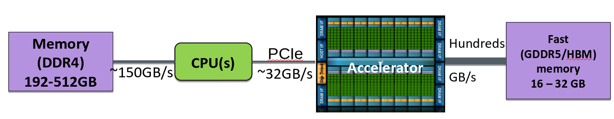

# SYCL Memory Management{.section}

# Accelerator Model Today

- GPUs have their own memory separate from the CPU memory
- GPUs are connected to CPUs via PCIe
- Data must be copied from CPU to GPU over the PCIe bus

{width=100%}

# SYCL Memory Models

 - three memory-management abstractions in the SYCL standard:

      - **buffer and accessor API:**: a buffer encapsulate the data and accessors describe how you access that data
      - **unified shared memory**: pointer-based approach to C/C++/CUDA/HIP
      - **images**: similar API to buffer types, but with extra functionality tailored for image processing (will not be discussed here)

# Buffers and Accesors I
 -  a **buffer** provides a high level abstract view of memory 
 - support 1-, 2-, or 3-dimensional data
 - dependencies between multiple kernels are implicitly handled
 - buffers get to be initialized them from already existing objects
 - does not own the memory, it’s only a *constrained view* into it
 - accessor objects are used to access the data
 - three possible access modes, *read_write*, *read_only*, or *write_only*
 - can have also host accessors

# Buffers and Accesors II
 
```cpp
 std::vector<int> y(N);
 std::fill(y.begin(), y.end(), 1);
 {
    // Create buffers for data 
    buffer<int, 1> a_buf(y.data(), range<1>(N));
    q.submit([&](handler& cgh) {
      accessor a{a_buf, cgh, read_write};
      cgh.parallel_for(range<1>(N), [=](id<1> id) {
        y[id] +=1;
      });
    });
    host_accessor result{a_buf};
    for (int i = 0; i < N; i++) {
      assert(result[i] == 2);
    }
 }
``` 


# Summary
