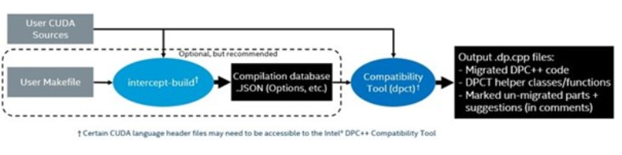

# SYCLomatic Exercise

We use one NVIDIA CUDA example, called  `Odd-Even MergeSort`, and follow the steps from here:\
https://github.com/oneapi-src/oneAPI-samples/tree/development/DirectProgramming/C%2B%2BSYCL/DenseLinearAlgebra/guided_odd_even_merge_sort_SYCLMigration

Because this example uses a Makefile and contains multiple CUDA source files, we're using the `intercept-build` tool.



## 1. Get the NVIDIA CUDA example

```bash
git clone https://github.com/NVIDIA/cuda-samples.git
```

## 2. Intercept CUDA code and convert


```bash
cd cuda-samples/Samples/2_Concepts_and_Techniques/sortingNetworks/
intercept-build make
c2s -p compile_commands.json --in-root ../../.. --gen-helper-function
```

```bash
intercept_convert.sh
```

## 3. How well did it go?

Check the conversion messages (purple warnings) and look at the respective files.\
-> This will still require some work to run.
<br>
Your are welcome to do this, but we will have a look at the solution
## 4. Get the Solution

```bash
git clone https://github.com/oneapi-src/oneAPI-samples.git
```

```bash
cp -fr oneAPI-samples/DirectProgramming/C++SYCL/DenseLinearAlgebra/guided_odd_even_merge_sort_SYCLMigration/* cuda-samples/Samples/2_Concepts_and_Techniques/sortingNetworks/
```

Feel free to inspect the modifications applied in the migrated files in the directory `cuda-samples/Samples/2_Concepts_and_Techniques/sortingNetworks/02_sycl_migrated/`. The originally converted files are at `cuda-samples/Samples/2_Concepts_and_Techniques/sortingNetworks/dpct_output/`.

## 5. Build and run for NVIDIA GPU

```bash
cd cuda-samples/Samples/2_Concepts_and_Techniques/sortingNetworks/
rm -r build
mkdir build && cd build
cmake -D NVIDIA_GPU=1 .. && make VERBOSE=1
```

## 6. Build and run for Intel/AMD CPU

```bash
cd cuda-samples/Samples/2_Concepts_and_Techniques/sortingNetworks/
rm -r build
mkdir build && cd build
cmake .. && make VERBOSE=1
```


```
